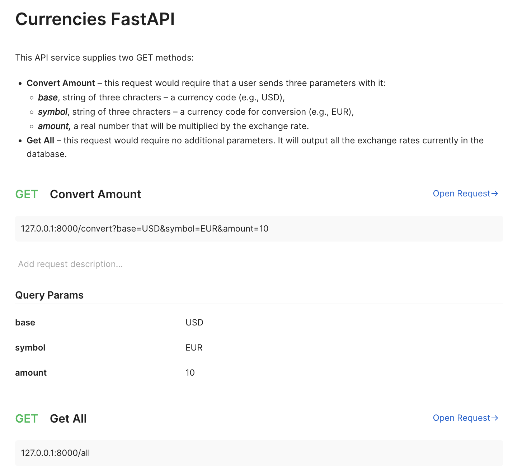

# Readme

## API documentation

### Example usage



### Example installation

#### To compose and run a dockerized app type in the following commands in a terminal

```zsh
docker build -t mycurrencyapi https://github.com/FunnyRabbitIsAHabbit/SQLAlchemy_DependencyInjector_FastAPI_CurrencyExchange.git#master
```

```zsh
docker run -it -d -p 4040:4040 mycurrencyapi
```

_Docker is required for this to work_

